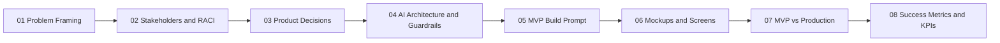

# [Your Name] — AI Product Manager Portfolio

I'm an AI Product Manager with 5+ years of experience building products at the intersection of business risk, compliance, and applied AI. This repository is a working portfolio of case studies — each one shows how I frame a problem, make product and architecture decisions under real-world constraints, and validate whether the solution actually worked.

Each case study is **not a production system**. It's a scoped MVP proof-of-concept, built to demonstrate product and technical reasoning quickly — paired with an explicit section on what would change to make it production-ready. I think this distinction matters: a good AI PM should be able to move fast on a proof of concept *and* reason clearly about what separates a demo from a system a bank, or Apple, or Netflix could actually ship.

## How to read this repo

Every case study folder follows the same numbered structure, so you can read top to bottom like a narrative, or jump to the section you care about:

## Case Studies

| # | Case Study | Domain | Status |
|---|---|---|---|
| 1 | [Tech Risk Contract Processing](./case-studies/tech-risk-contract-processing/) | Investment Banking — Technology Risk | In progress |
| 2 | *(coming soon)* | | |
| 3 | *(coming soon)* | | |

## Why this structure

Most AI PM case studies stop at "here's a cool demo." I wanted mine to also answer the questions a hiring panel actually probes for:

- **Why this problem, and why now** → Problem Framing
- **Who else needs to be in the room** → Stakeholders and RACI
- **What tradeoffs did you make, and why** → Product Decisions
- **How do you prevent this AI system from doing something dangerous or wrong** → AI Architecture and Guardrails
- **Can you actually direct a build, not just talk about one** → MVP Build Prompt + Mockups
- **Do you understand the gap between a demo and a real system** → MVP vs Production
- **How would you know if this succeeded** → Success Metrics and KPIs

## About me

*(Short bio — role, industry background, why AI product management, 2–3 lines)*

## Contact

*(LinkedIn / email / portfolio site)*
