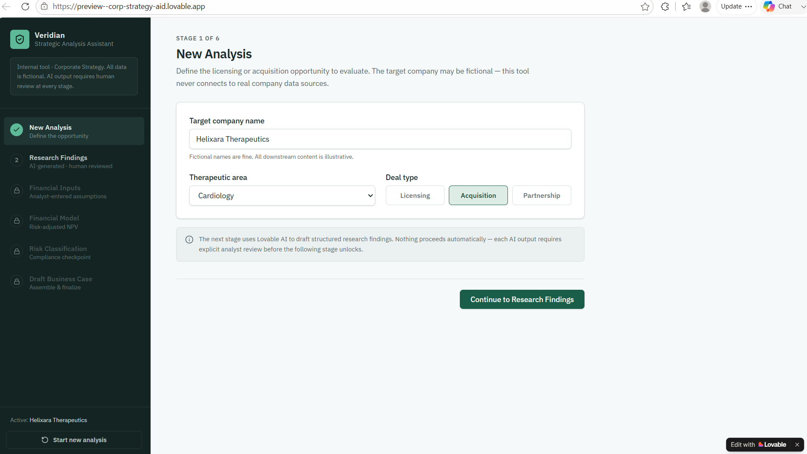
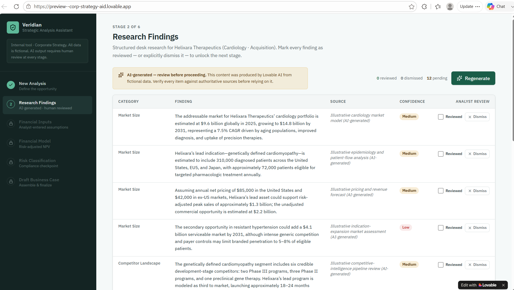
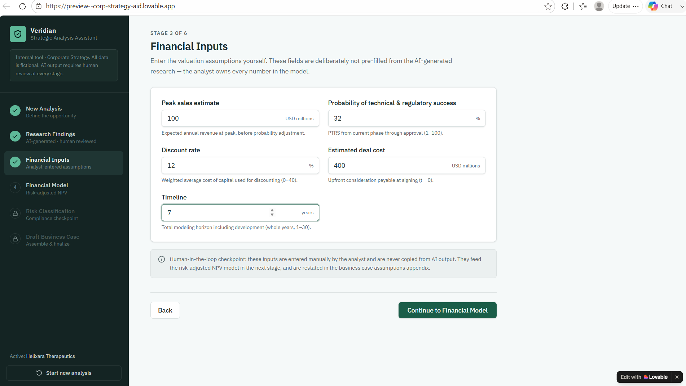
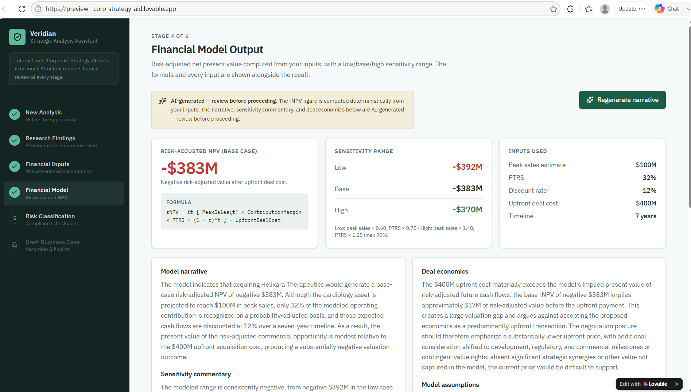
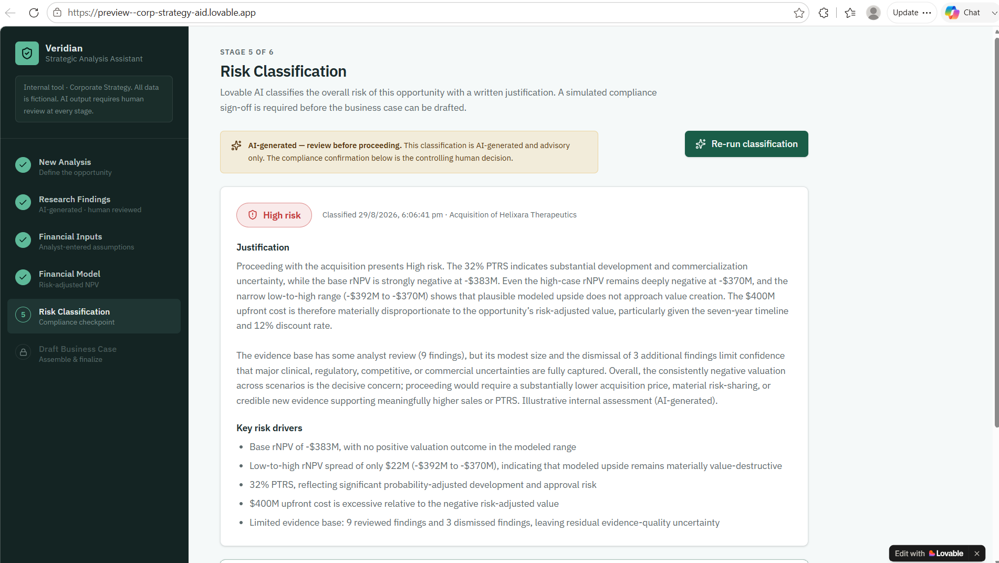
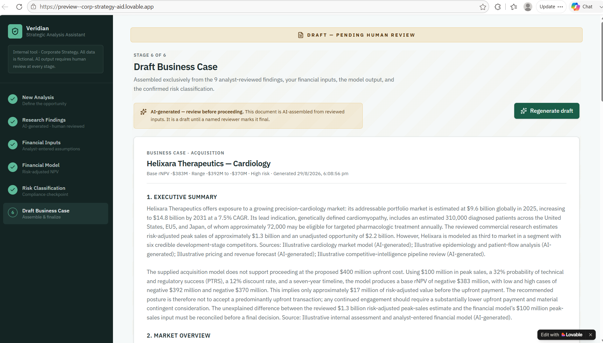

# Screen Walkthrough

Prototype is built from [lovable-prompt.md](../lovable-prompt.md), 

## 1. New Analysis

Analyst starts a new business case with basic deal parameters.

## 2. Research Findings

Agent output — every row requires explicit analyst sign-off before continuing.

## 3. Financial Inputs

Data is entered manually by human - reviewed by Finance dept for accuracy and backup in case of cross-questioning

## 4. Financial Model

Agent output — output has to be manually reviewed by Human and signed off before moving on to next step

## 5. Risk Classification

Agent output — output has to be manually reviewed by Human and signed off before moving on to next step. Here Risk team is consulted to verify AI generated output.

## 6. Draft Business Case

Agent output — output has to be manually reviewed by Human and signed off before moving on to presentation. 
