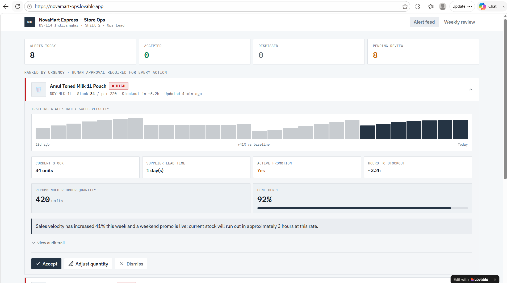
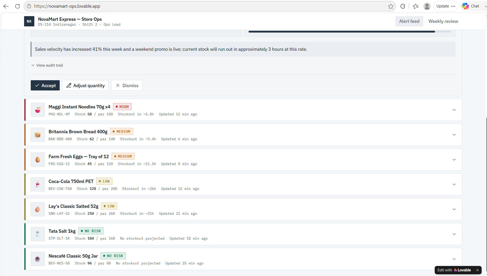
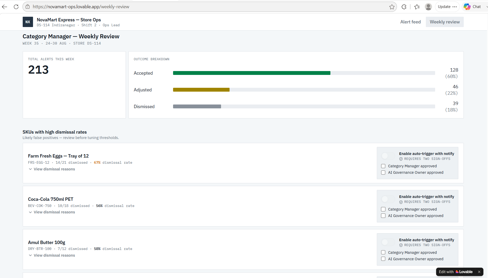

# Screen Walkthrough

Prototype is built from [lovable-prompt.md](case-studies/retail-gen-ai/use-cases/01-dark-store-stockout-agent/lovable-prompt.md),

## Screen 1 — Store Ops Alert Feed

The primary screen a Store Ops Lead sees during a shift.

- A ranked list of SKUs at risk, sorted by `estimated_hours_to_stockout` (most urgent first).
- Each row shows: SKU name, current stock, risk level (color-coded: none/low/medium/high), and a data-freshness timestamp.
- Tapping a row expands the agent's plain-language rationale and the recommended reorder quantity.
- Three actions per alert: **Accept**, **Adjust Quantity**, **Dismiss** (with required reason code).

## Screen 2 — Recommendation Detail

- Shows the full reasoning trail: velocity trend (simple sparkline), current stock, supplier lead time, and any active promotion flag.
- Confidence score displayed as a percentage, with a plain note when confidence is below the auto-escalation threshold ("Escalated to Supply Chain Planner — confidence too low for a direct recommendation").
- An audit trail link showing exactly what inputs the agent used to produce this specific recommendation.

## Screen 3 — Category Manager Weekly Review

- Aggregates the week's alerts: accepted, adjusted, dismissed (with reason codes).
- Highlights SKUs with a high dismissal rate — the primary signal used to catch false positives before they erode store ops' trust in the tool.
- A simple toggle (behind Category Manager + AI Governance Owner sign-off) to move a SKU from "recommend only" to "auto-trigger with notify," per the graduation criteria in the PRD.

## Design Intent

The UI deliberately keeps every screen answerable in under 10 seconds — a Store Ops Lead is working a live shift, not reviewing a report. Depth (the full reasoning trail) is one tap away for anyone who wants to audit a specific recommendation, but never the default view.
