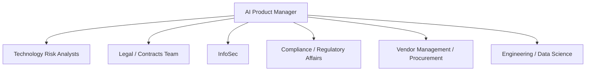

# 02. Stakeholders & RACI

## Why this matters
Contract risk tooling touches multiple functions with different mandates (legal enforceability, regulatory compliance, security posture, business speed). Naming them upfront prevents ambiguity — and shows I understand this isn't a solo build.

## Stakeholder map

## RACI table

| Activity | Tech Risk Analysts | Legal | InfoSec | Compliance | Vendor Mgmt | Engineering |
|---|---|---|---|---|---|---|
| Define risk clause taxonomy | R | C | C | A | I | I |
| Validate regulatory mapping (OCC/FFIEC/NYDFS) | C | C | I | A/R | I | I |
| Approve human-in-the-loop thresholds | A | I | C | R | I | C |
| Build/train AI model | I | I | C | I | I | A/R |
| Security review of AI pipeline | I | I | A/R | I | I | C |
| Sign-off for pilot rollout | R | C | C | A | C | I |

*(R = Responsible, A = Accountable, C = Consulted, I = Informed — adjust as your reasoning develops)*

## Escalation path
*(When does something get kicked from analyst → risk lead → compliance? Define the trigger.)*
