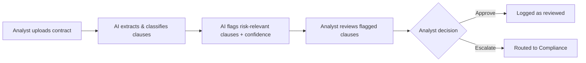

# 03. Product Decisions

## Scope of the MVP
*(What's in: e.g. US regulatory frameworks only — OCC, FFIEC, NYDFS. Vendor/technology outsourcing contracts — cloud, SaaS, IT services.)*

## What's explicitly out of scope (and why)
*(e.g. non-US jurisdictions, non-tech vendor contracts, autonomous approval — deferred to keep MVP demonstrable in one review cycle)*

## Key tradeoffs

| Decision | Option chosen | Alternative considered | Why |
|---|---|---|---|
| *(e.g. Review flow)* | *(AI flags + ranks, human approves)* | *(Fully automated approval)* | *(Risk tolerance too low for autonomous decisions at MVP stage)* |
| | | | |
| | | | |

## User journey (MVP)

## Open questions / risks I'd validate next
*(What would you still need to test with real users before going further?)*
