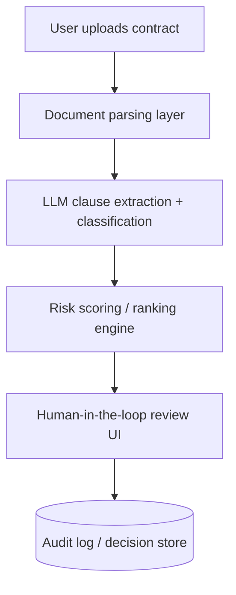

# 04. AI Architecture & Guardrails

## Model choice
*(Which model/approach, and why — e.g. LLM-based clause extraction + classification via Lovable's AI Gateway. Why this over a traditional NLP/rules pipeline?)*

## System view
*(High-level architecture — this is the level a Solution Architecture Document, or SAD, would formalize once this moves past MVP: system components, data flow, integration points, security boundaries.)*

## Where I'd write an ADR (Architecture Decision Record)
*(An ADR captures ONE significant, hard-to-reverse decision with its context and consequences — useful for decisions like:)*
- *(Choice of LLM provider/model for regulated data)*
- *(Whether contract data is processed in-region vs sent to a third-party API)*
- *(Confidence-threshold logic for auto-flag vs auto-escalate)*

*(Note: I'm not writing full ADRs for the MVP — I'm flagging where they'd belong in a real build, to show I understand the discipline.)*

## Hallucination & bias mitigation
*(How do you reduce the risk of the AI inventing a clause interpretation or missing a real risk? e.g. retrieval-grounded prompts tied to actual contract text, confidence scoring, mandatory human review above a risk threshold, no autonomous decisions.)*

## Human-in-the-loop design
*(At what point is a human required, not optional? What's the escalation trigger?)*

## Data & privacy considerations
*(Even at MVP stage — what contract data is sensitive, and how do you avoid exposing it inappropriately, even in a demo?)*
