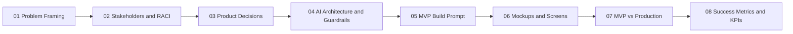

# Case Study: AI-Automated Contract Processing for Technology Risk

**Industry:** Investment Banking

**Function:** Technology Risk / Vendor & Outsourcing Risk Management

**Role simulated:** AI Product Manager

**Status:** MVP proof-of-concept (not production)

## Summary

An AI-assisted workflow that reads vendor/technology contracts, flags risk-relevant clauses, and routes them to the right human reviewer — cutting first-pass review time while keeping a human in the loop for every high-risk decision.

## Why this case study

Technology Risk teams at banks manually review thousands of vendor and outsourcing contracts (cloud, SaaS, IT services) against regulatory frameworks like OCC, FFIEC, and NYDFS guidance. This is exactly the kind of high-stakes, document-heavy, judgment-required process where AI can help — and where getting the guardrails wrong is genuinely dangerous. That tension is what makes it a good AI PM case study.

## How to read this repo

Every case study folder follows the same numbered structure, so you can read top to bottom like a narrative, or jump to the section you care about:

## Read the case study

| # | File | What it covers |
|---|---|---|
| 1 | [Problem Framing](./01-problem-framing.md) | The problem, who feels the pain, why now |
| 2 | [Stakeholders & RACI](./02-stakeholders-raci.md) | Who needs to be involved, and when |
| 3 | [Product Decisions](./03-product-decisions.md) | Scope, tradeoffs, what's in/out of the MVP |
| 4 | [AI Architecture & Guardrails](./04-ai-architecture-guardrails.md) | Model choice, hallucination/bias mitigation, human-in-the-loop design |
| 5 | [MVP Build Prompt](./05-mvp-build-prompt.md) | The actual prompt used to build the MVP in Lovable AI |
| 6 | [Mockups & Screens](./06-mockups/) | Visual walkthrough of the MVP |
| 7 | [MVP vs Production](./07-mvp-vs-production.md) | What changes before this is real |
| 8 | [Success Metrics & KPIs](./08-success-metrics-kpis.md) | How we'd know it worked |

## Why this structure

Most AI PM case studies stop at "here's a cool demo." I wanted mine to also answer the questions a hiring panel actually probes for:

- **Why this problem, and why now** → Problem Framing
- **Who else needs to be in the room** → Stakeholders and RACI
- **What tradeoffs did you make, and why** → Product Decisions
- **How do you prevent this AI system from doing something dangerous or wrong** → AI Architecture and Guardrails
- **Can you actually direct a build, not just talk about one** → MVP Build Prompt + Mockups
- **Do you understand the gap between a demo and a real system** → MVP vs Production
- **How would you know if this succeeded** → Success Metrics and KPIs

## Artifacts

- MVP link: *(add Lovable app link once ready)*
- Full case-study writeup (Word doc): *(link if you want to keep the long-form version too)*
